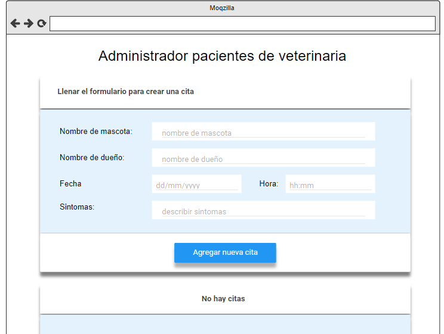
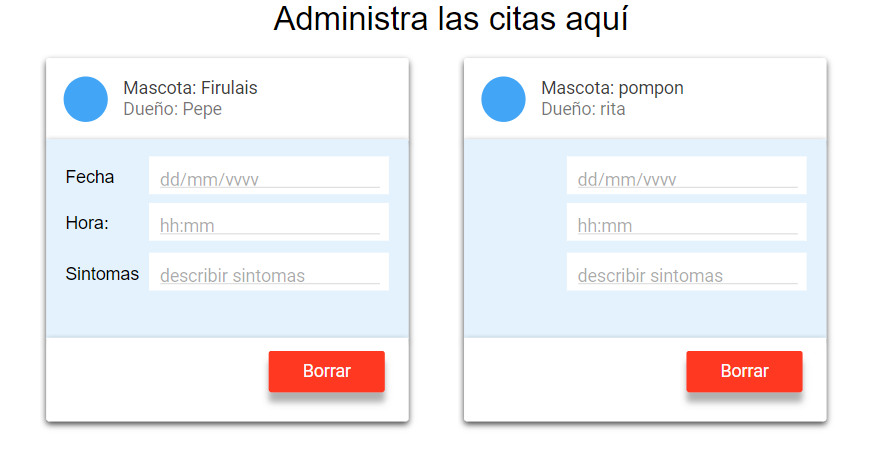

## Trabajo Práctico React

### Ejercicio 9

9. Pacientes de veterinaria - Dificultad: 🟢🟡🔴

Crear una aplicación web que permite cargar un formulario para registrar una cita en una veterinaria, todos los datos solicitados en el formulario deben ser obligatorios.

La aplicación debe permitir borrar las citas y estas deben ser guardadas en el localstorage.



Si hay citas debo mostrarlas, con sus respectivos datos dentro de una card:



---

Utilizamos [React-Bootstrap](https://react-bootstrap.netlify.app/) **v2.9.0** en nuestro proyecto para incoroporar el Container, Form, Button, InputGroup, y usamos el **"bootstrap/dist/css/bootstrap.min.css"** para utilizar los estilos de Bootstrap.

> **IMPORTANTE:** Para ambos casos tenemos que importar estas herramientas con el **import**.

### Repositorio 💻

Los ejercicios se encuentran en el sgte. repositorio:
https://github.com/EmiTorres93/RCS-43i-React_exercise9

- Para clonar el Repositorio:

```bash
git clone https://github.com/EmiTorres93/RCS-43i-React_exercise9
```

- Para contribuir con el proyecto ponerse en contacto con el sgte. mail: **emiliana.mt93@gmail.com**

## Autores

1. Emiliana M. Torres [GitHub](https://github.com/EmiTorres93)
